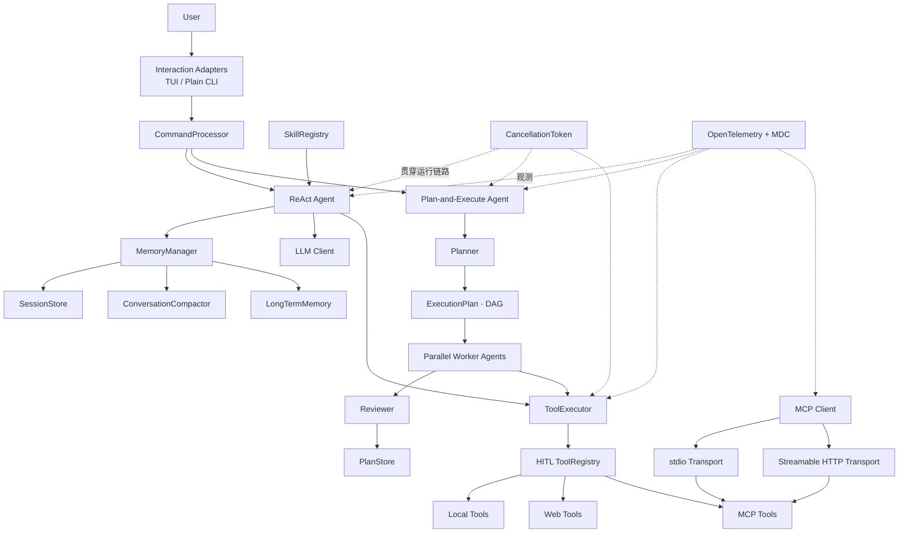

<div align="center">

# Xcode Agent

**一个使用 Java 17 从零实现的模块化 Coding Agent**

围绕执行、规划、工具、记忆、扩展、安全与可观测性，探索 Coding Agent 从“能调用工具”到“可控、可恢复、可演进”的工程设计。


</div>

[项目定位](#项目定位) · [系统架构](#系统架构) · [核心模块设计](#核心模块设计) · [快速开始](#快速开始) · [测试](#测试) · [Roadmap](#roadmap)

## 项目定位

Xcode Agent 是一个运行在终端中的 AI 编程助手。它可以理解编程任务，读取和搜索项目文件，修改代码，执行命令，访问网页，并根据工具返回结果持续决定下一步。

项目围绕大模型 Chat Completions API 实现完整运行时，主要关注以下问题：

- 简单任务如何通过 ReAct 快速完成，复杂任务如何拆分成可并行的依赖图。
- 工具调用、参数解析、审批、异常和结果回灌如何形成统一协议。
- 多轮对话、任务目标、长期经验和执行计划如何进入上下文，又不污染原始历史。
- 写文件、执行命令等有副作用的操作，在超时、取消或进程崩溃后如何避免重复执行。
- Skills 和 MCP 如何扩展 Agent，同时不把具体能力硬编码进核心循环。
- 并行 Worker、模型请求、工具和外部进程如何共享取消信号与 Trace 上下文。

### 能力概览

| 模块 | 能力 |
| --- | --- |
| ReAct 执行引擎 | 多轮 `Think → Act → Observe`、SSE 流式响应、Tool Call 增量重组 |
| Plan-and-Execute | DAG 规划、依赖校验、并行调度、Reviewer 验收、失败重规划 |
| 工具系统 | 统一工具协议、注册、参数解析、错误归一化、超时与结果回灌 |
| 记忆系统 | 会话持久化、上下文压缩、目标锚定、项目/全局长期记忆、经验沉淀 |
| 安全控制 | HITL 审批、工作区边界、SSRF 防护、敏感信息脱敏、副作用恢复 |
| 扩展机制 | 分层 Skills、动态 MCP 工具、Web Search / Fetch |
| 可观测性 | OpenTelemetry、结构化日志、MDC 与跨线程上下文传播 |
| 交互层 | 共享命令路由、TUI / plain 双前端和非交互环境自动降级 |

## 系统架构



### 模块边界

```text
com.xu
├── agent/          ReAct Agent、Plan-and-Execute 编排、Reviewer
├── plan/           Planner、DAG、Task、Checkpoint
├── tool/           工具协议、注册表、执行器与内置工具
├── memory/         会话、上下文压缩、长期记忆与经验提炼
├── skill/          Skill 发现、解析、覆盖与状态管理
├── http/           OkHttp 可中断执行支持
├── mcp/            通用 MCP 协议、懒加载与 stdio / HTTP Transport
├── hitl/           风险策略、人工审批与工具拦截
├── llm/            DeepSeek API、SSE 与 Tool Call 重组
├── observability/  Trace、MDC 和跨线程上下文传播
├── ui/             UI 事件、显示脱敏与交互适配
├── cli/            启动装配和统一命令路由
└── util/           generation-scoped 取消等通用能力
```

## 核心模块设计

### 1. ReAct 执行引擎

`Agent` 是直接任务的执行核心。它最多运行 20 轮，每轮根据模型返回决定结束或继续调用工具。

```text
用户任务
  → 冻结本次任务相关记忆与工具定义
  → 组装 system、目标、记忆和真实对话历史
  → 检查 Token 预算，必要时压缩旧轮次
  → 调用 LLM
      ├─ 返回最终文本：保存会话并结束
      └─ 返回 tool_calls
           → ToolExecutor 执行
           → 每个 tool_call 写入对应 tool result
           → 进入下一轮
```

这里有三个关键设计。

#### 任务级记忆快照与动态工具

`MemoryManager.beginTask()` 在任务开始时冻结本次长期记忆，避免执行途中因热重载
产生前后不一致的知识上下文；工具定义则在每个 ReAct 轮次重新从
`ToolRegistry` 生成，使 `start_*_mcp` 完成后动态注册的 MCP 工具能在下一轮
立即被模型看到。

#### 流式文本与 Tool Call 分开处理

DeepSeek SSE 中，普通 `content` 可以立即增量展示；`tool_calls[index]` 的函数名和 JSON 参数却可能被拆到多个 chunk。`LlmClient` 按 index 累积碎片，只有得到完整消息后才允许解析和执行，避免半段 JSON 触发工具。

#### 对话协议与副作用一致性

一条 assistant 消息中的每个 Tool Call 最终都必须对应一条 tool result。发生异常或取消时，Agent 会为未完成调用补充明确的失败结果，保证下一轮请求仍满足 Chat API 协议。

如果工具尚未执行，可以回滚本轮临时历史；如果已经发生写文件、命令等副作用，则保留成功结果并标记未完成部分为“状态未知”，防止模型忘记外部世界已经被修改。

---

### 2. Plan-and-Execute 编排

复杂任务通过 `/plan` 进入另一条执行链路：

```text
用户目标
  → Planner 生成 Task DAG
  → 校验未知依赖和循环依赖
  → 找出依赖全部完成的 Ready Tasks
  → 最多 4 个 Worker 并行执行
  → Reviewer 独立验收
  → 更新 Task 状态并保存 checkpoint
  → 必要时对剩余任务重规划
  → 汇总最终报告
```

#### 用 DAG 表达真实依赖

`ExecutionPlan` 不要求所有步骤串行执行。每轮只选择满足以下条件的任务：

```text
status == PENDING
并且所有 dependencies == COMPLETED
```

独立步骤可以并行，有依赖的步骤保持顺序。计划创建时使用 DFS 检查环，并对不存在的依赖给出明确错误，避免调度器进入“没有 Ready Task、计划又未结束”的假死状态。

#### Worker 执行与 Reviewer 验收分离

Worker Agent 负责完成步骤，Reviewer 只根据总目标、步骤描述和执行结果判断是否通过。审查不通过且本次没有使用可变工具时，可以携带反馈重做；一旦任务已经产生副作用，则不会为了通过 Reviewer 而自动重放整步。

#### Checkpoint 是执行协议的一部分

`PlanStore` 不是简单的退出保存：

- Worker 提交前先将任务持久化为 `IN_PROGRESS`，写入失败则不执行任务。
- 每个任务结束后立即原子更新 checkpoint。
- 普通、确定性的失败可以保留已完成结果并重规划剩余步骤。
- 超时、取消、进程崩溃或副作用状态未知时，停止自动重规划并要求人工检查。
- 恢复时不会把旧的 `IN_PROGRESS` 静默改回 `PENDING`，避免写文件或命令被重复执行。

这种设计的原则是：**可恢复不等于自动重试，恢复首先要保证外部副作用不会被重复制造。**

---

### 3. 工具系统

工具链路被拆成五层：

```text
Tool
  → ToolRegistry
  → HitlToolRegistry
  → ToolExecutor
  → ToolExecutionResult
```

#### `Tool`

每个工具只声明名称、描述、JSON Schema 和执行方法，不依赖 Agent、UI 或审批实现。

#### `ToolRegistry`

负责工具发现和按名称查找，也是生成模型 Tool Schema 的唯一入口。MCP 工具和本地工具最终都进入同一注册表，因此 Agent 不需要区分它们来自 Java 代码还是外部进程。

#### `HitlToolRegistry`

在注册边界包装有风险的工具。`write_file`、`execute_command` 和 `mcp__*` 默认需要人工确认，而只读工具可以直接执行。审批逻辑不进入工具实现，也不进入 Agent Loop。

#### `ToolExecutor`

统一完成：

- Tool Call JSON 参数解析；
- 工具不存在、参数错误和运行异常的错误归一化；
- Trace、耗时、退出码和结果大小记录；
- 取消前后检查；
- UI 事件发布；
- 将异常转换成模型能够继续处理的 Tool Result。

`ToolExecutionResult` 使用结构化字段表达 `success`、`errorType`、`exitCode` 和 `timedOut`，调用方不需要通过字符串猜测执行状态。

#### 内置工具

| 工具 | 作用 | 主要边界 |
| --- | --- | --- |
| `read_file` | 读取项目文件 | 工作区路径约束 |
| `list_dir` | 查看目录 | 只读 |
| `glob_files` | Glob 搜索文件 | 从项目根遍历 |
| `write_file` | 创建或覆盖文件 | 禁止逃逸项目根，默认审批 |
| `execute_command` | 执行 Shell 命令 | 默认审批、超时、输出上限、进程树取消 |
| `web_search` | 搜索互联网 | 独立 API Key |
| `web_fetch` | 提取静态网页正文 | SSRF 防护、重定向复检、5 MB 上限 |
| `load_skill` | 按需加载 Skill | 只读、受 Skill 注册表约束 |
| `mcp__*` | 外部 MCP 能力 | 动态注册、默认审批 |

---

### 4. 记忆与上下文管理

记忆模块没有把所有数据都称为“Memory”，而是按生命周期分成三层。

| 层次 | 组件 | 职责 |
| --- | --- | --- |
| 会话历史 | `SessionStore`、`ConversationCompactor` | 保存真实消息；超出预算时压缩旧轮次 |
| 任务上下文 | `MemoryManager` | 注入目标、冻结的长期记忆和 Plan 状态 |
| 长期记忆 | `LongTermMemory`、`LessonExtractor` | 保存跨会话知识并在新任务开始时检索 |

#### Prompt 组装

`MemoryManager` 在每轮请求前按固定顺序生成消息：

```text
1. 基础 system prompt + Skill 轻量索引
2. 当前目标锚点
3. 本次任务冻结的长期记忆
4. Plan 上下文
5. 原始 user / assistant / tool 历史
```

目标、长期记忆和 Plan 状态只在请求时临时注入，不写进 `session.jsonl`。这样可以保持持久化历史干净，也能减少任务目标在长对话中被淹没。

#### 对话压缩

`ConversationCompactor` 按完整 user turn 划分历史，不会拆开 assistant Tool Call 与对应的 Tool Result。最近轮次保留原文，旧轮次转换成滚动摘要；模型压缩失败时降级保留最近若干轮，主任务仍可继续。

#### 长期记忆读取

```text
用户任务
  → jieba 分词
  → 过滤当前 PROJECT 记忆和全部 GLOBAL 记忆
  → 关键词命中率 × 时间衰减
  → 取 Top 3
  → 在整个 ReAct 任务内冻结
```

长期记忆注入有字符预算，不会无限挤占主对话上下文。

#### 长期记忆写入与治理

人工 `/save` 和 Agent 自动经验都通过 `LongTermMemory.save()`：

- 人工记忆可信度高，主要处理精确重复和近似合并。
- Agent 经验携带置信度，低置信内容可以延迟进入审核队列。
- Agent 经验有容量限制，相似的新经验会替换旧经验。
- `LessonExtractor` 只在检测到“工具失败后修正成功”的轨迹时提炼经验，不对普通回答随意沉淀。

当前数据规模最多几十条，因此文件存储、关键词检索和治理都收敛在一个具体实现中；等真正出现向量库等第二种实现时再抽象接口，避免为了假想扩展点增加层级。

详细说明见 [Memory 设计](docs/memory_design.md)。

---

### 5. Skills 扩展机制

Skills 用 Markdown 描述某类任务的专门工作流。注册表按照以下优先级加载：

```text
builtin < ~/.xcode/skills < <project>/.xcode/skills
```

同名 Skill 由更靠近项目的一层覆盖，类似 Git 配置的 system / global / local 模型。注册表支持 frontmatter 校验、启停状态和热重载。

为了控制上下文体积，system prompt 只注入受预算限制的 Skill 名称和简介。当模型判断任务命中某个 Skill 时，再调用 `load_skill` 读取完整 `SKILL.md`。这是一个渐进式披露过程：

```text
轻量索引常驻 → 模型选择 Skill → 按需加载完整规则
```

---

### 6. MCP 外部能力

项目使用一个通用 `McpClient` 承担握手、工具发现和调用，并通过不同
Transport 接入本地与远程 MCP：

```text
start_*_mcp（首次使用）
  → LazyMcpClient 保证并发只初始化一次
  → initialize / initialized
  → tools/list 分页发现能力
  → 白名单过滤并添加 mcp__<server>__ 命名空间
  → 动态注册到 ToolRegistry
  → tools/call
```

`StdioMcpTransport` 负责 Chrome 子进程、请求 ID 和响应匹配；
`StreamableHttpMcpTransport` 负责 DeepWiki 的 HTTP POST、JSON/SSE 双响应、
Session Header 和远程会话关闭。两种传输共享同一套 MCP 生命周期与动态 Tool
适配代码。外部工具的行为无法由本项目完全预测，因此所有 `mcp__*` 工具默认经过 HITL。

MCP 在应用启动时不连接：Chrome 不会提前启动 npx，DeepWiki 也不会提前发起
网络请求。首次连接失败只影响本次启动工具调用，不影响本地工具和主 Agent。

---

### 7. 安全、取消与恢复

这些能力没有放在某一个边缘模块里，而是贯穿整个执行链路。

#### 人工审批

HITL 支持允许一次、当前会话始终允许、跳过和拒绝。会话级放行只存在内存中，执行 `/clear` 或退出后失效。TUI 与 plain 使用不同交互实现，但共享同一个风险策略。

#### Generation-scoped 取消

每次用户任务拥有独立 generation。`Ctrl+C` 或程序关闭时，取消会传播到：

```text
主 Agent
  → Plan 子任务
  → LLM / Web OkHttp Call
  → 待审批 Future
  → ToolExecutor
  → Shell 进程及其子进程
```

新任务不会复用旧任务的取消状态，也不会在旧 Worker 尚未退出时并发修改同一份会话。

#### 显示与日志脱敏

API Key、Token、Password、Authorization、Cookie、JWT、敏感 URL 参数、正文类参数以及终端控制字符会在展示边界统一处理。日志和 Span 默认只记录类型、长度、耗时、Token、退出码和错误信息，不记录完整 Prompt、源码或工具正文。

#### 网络与文件边界

- 写文件前标准化路径并验证不能逃逸项目根目录。
- Web Fetch 拦截回环、私网、链路本地和其他非公网地址。
- 每次重定向都重新进行目标校验，避免通过跳转绕过 SSRF 防护。
- HTTP、命令和 Plan Worker 都有可取消的超时边界。

---

### 8. 可观测性

项目使用 OpenTelemetry 描述父子调用关系，使用 MDC 将 Trace 上下文传入结构化日志：

```text
agent.run
├── agent.turn
│   ├── llm.chat
│   └── tool.execute
│       └── mcp.call
└── plan.run
    └── plan.task
        ├── agent.run
        └── reviewer.run
```

Plan Worker 跨线程执行时，通过 `ContextAwareTasks` 同时传播 OpenTelemetry Context 和 MDC。这样即使多个任务并行，日志仍能关联到正确的 `trace_id`、`plan_id` 和 `task_id`。

默认只写按项目隔离的本地滚动日志。配置标准 OTLP 环境变量后，可以接入 Jaeger、Tempo 等后端：

```dotenv
OTEL_SERVICE_NAME=xcode-agent
OTEL_TRACES_EXPORTER=otlp
OTEL_EXPORTER_OTLP_ENDPOINT=http://localhost:4317
```

---

### 9. 交互层

交互不是 Agent 核心的一部分。`CommandProcessor` 统一处理 Slash Command，TUI 和 plain CLI 只是两个适配器：

```text
Agent / Plan / Tool / HITL
          ↓ immutable UiEvent
     UiEventSink
       ├── JLine TUI
       └── Plain CLI
```

核心模块不直接依赖 JLine，也不输出 ANSI。交互终端支持富文本、历史和状态展示；IDE Console、管道或终端能力不足时自动使用纯文本模式。界面实现的详细说明见 [TUI 设计](docs/tui-design.md)。

## 数据目录

项目根目录由启动程序时的当前工作目录决定。不同项目的会话、记忆、计划和日志按“项目名 + 路径哈希”隔离：

```text
~/.xcode/
├── projects/<project@path-hash>/
│   ├── logs/
│   ├── session.jsonl
│   ├── knowledge.json
│   ├── plan_checkpoint.json
│   └── input_history
├── skills/
└── skills.json

<project>/.xcode/
└── skills/
```

`PlanStore` 保存执行状态，属于 Plan 模块；`session.jsonl` 和 `knowledge.json` 才属于记忆模块。

## 快速开始

### 环境要求

- JDK 17+
- Maven 3.8+
- DeepSeek API Key
- 可选：Node.js、npm/npx、Chrome，用于 Chrome DevTools MCP
- 可选：访问 DeepWiki 的网络，用于公开 GitHub 仓库分析
- 可选：腾讯云联网搜索 API Key，用于 `web_search`

### 1. 克隆与配置

```bash
git clone https://github.com/vanishValley/Xcode.git
cd Xcode
```

Windows PowerShell：

```powershell
Copy-Item .env.example .env
```

Linux / macOS：

```bash
cp .env.example .env
```

编辑 `.env`：

```dotenv
DEEPSEEK_API_KEY=your_deepseek_api_key_here
DEEPSEEK_MODEL=deepseek-chat

# 危险工具审批，默认开启
HITL_ENABLED=true

# 可选：联网搜索
WSA_API_KEY=your_tencent_wsa_api_key_here

# 可选：Chrome MCP
CHROME_MCP_ENABLED=true
CHROME_MCP_HEADLESS=true
CHROME_MCP_PACKAGE=chrome-devtools-mcp@1.6.0

# 可选：DeepWiki 远程 MCP（无需 API Key）
DEEPWIKI_MCP_ENABLED=true
DEEPWIKI_MCP_URL=https://mcp.deepwiki.com/mcp

# 可选：日志
XCODE_LOG_LEVEL=INFO
```

> [!IMPORTANT]
> `.env` 已加入 `.gitignore`。不要把真实 API Key 写入源码、README、命令历史或 `.env.example`。

不需要 Chrome 浏览器能力时，建议设置：

```dotenv
CHROME_MCP_ENABLED=false
```

### 2. 构建

```bash
mvn clean package
```

构建产物：

```text
target/Xcode-1.0-SNAPSHOT.jar
```

Shade Plugin 已将运行依赖和 Service Provider 合并进同一个可执行 JAR。

### 3. 在当前项目运行

```bash
java -jar target/Xcode-1.0-SNAPSHOT.jar
```

### 4. 在其他项目运行

程序使用当前工作目录作为项目根，而不是 JAR 所在目录：

```powershell
cd D:\workspace\your-project
$env:DEEPSEEK_API_KEY='your_key'
java -jar D:\notes\codes\Xcode\target\Xcode-1.0-SNAPSHOT.jar
```

此时读写文件、执行命令、项目记忆和日志都会以 `your-project` 为边界。

### UI 模式

```bash
# 自动选择，默认
java -jar target/Xcode-1.0-SNAPSHOT.jar --ui=auto

# 纯文本，适合 IDE Console、管道和 CI
java -jar target/Xcode-1.0-SNAPSHOT.jar --ui=plain

# 尝试启用富终端交互
java -jar target/Xcode-1.0-SNAPSHOT.jar --ui=tui
```

## 内置命令

| 命令 | 说明 |
| --- | --- |
| `/help` | 查看帮助 |
| `/status` | 查看模型、项目、HITL、工具与日志位置 |
| `/tools` | 查看当前注册的工具 |
| `/plan <任务>` | 使用 Plan-and-Execute 执行复杂任务 |
| `/hitl on/off` | 开启或关闭危险工具审批 |
| `/skills` | 查看已经发现的 Skills |
| `/skill reload` | 重新扫描 Skills |
| `/skill on/off <name>` | 启用或禁用指定 Skill |
| `/save <事实>` | 保存项目级长期记忆 |
| `/save -g <事实>` | 保存全局长期记忆 |
| `/memory` | 查看长期记忆 |
| `/memory clear` | 清空长期记忆 |
| `/history clear` | 清空终端输入历史 |
| `/clear` | 清空当前会话与审批放行状态 |
| `exit` / `quit` | 退出 |

## 测试

项目目前包含 **46 个测试类、165 项 JUnit 测试**。

覆盖范围包括：

- ReAct Tool Call、错误恢复和副作用历史一致性；
- SSE 文本与碎片化 Tool Call 重组；
- DAG 循环依赖、Ready Task 调度、Reviewer 和动态重规划；
- Checkpoint 写入、恢复、未知状态和超时不重放；
- Tool 参数解析、错误分类、退出码和 UI 事件顺序；
- 长期记忆检索、去重、治理、持久化和 Prompt 注入；
- Session 持久化、Token 预算和对话压缩；
- Skill frontmatter、三层覆盖、禁用和热重载；
- MCP stdio 请求匹配、Streamable HTTP JSON/SSE、Session Header、懒加载并发、分页、超时和关闭；
- OpenTelemetry Span、MDC 与线程池上下文传播；
- HITL 审批、会话放行和取消释放；
- API Key、Token、ANSI、OSC 与 Unicode 控制符脱敏；
- 多终端宽度渲染和 plain 非交互降级。

运行全部测试：

```bash
mvn test
```

生成完整可运行包并执行测试：

```bash
mvn clean package
```

## 设计文档

- [记忆模块设计](docs/memory_design.md)
- [TUI 交互层设计](docs/tui-design.md)
- [可观测性设计](docs/observability-design.md)
- [阶段实现总结](docs/phase1-2-summary.md)

## Roadmap

- [ ] 增加 Patch / Diff 工具，替代整文件覆盖
- [ ] 支持 Diff 预览和逐 hunk 审批
- [ ] 将工具权限从固定规则升级为可配置 Policy
- [ ] 抽象模型 Provider，支持多模型路由和降级
- [ ] 支持多个 MCP Server 的声明式配置
- [ ] 为长期记忆增加可持久化的人工审核队列
- [ ] 当数据规模需要时接入向量检索
- [ ] 增加更严格的工作区沙箱和资源配额

## 面试时可以展开的问题

- 为什么直接任务使用 ReAct，复杂任务使用 Plan-and-Execute？
- 为什么 Plan 使用 DAG，而不是让模型输出一个串行步骤列表？
- 如何处理并行 Worker、任务依赖、Reviewer 和 checkpoint 的一致性？
- 为什么超时或取消后的 `IN_PROGRESS` 任务不能直接重置成 `PENDING`？
- 工具审批为什么放在注册表边界，而不是 Agent 或工具内部？
- 如何保证 assistant Tool Call 与 tool result 在异常路径下仍然一一对应？
- 为什么目标、长期记忆和 Plan 上下文不直接写进会话历史？
- Skills 如何用渐进式披露降低上下文成本？
- 如何让 Java 本地工具和 MCP 外部工具共享同一执行协议？
- 如何在不记录 Prompt 和源码的前提下实现可排障的 Trace？

---

<div align="center">

如果这个项目对你有帮助，欢迎提交 Issue 或继续完善它。

</div>
