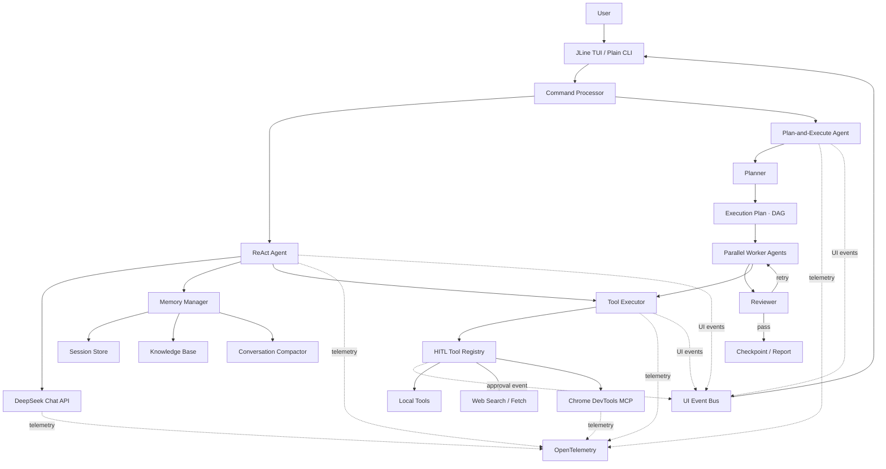

<div align="center">

# Xcode Agent

**一个使用 Java 17 从零构建、拥有 Claude Code 风格 TUI 的 Coding Agent**

从需求理解到工具执行：支持 ReAct、Plan-and-Execute、长期记忆、Skills、MCP 与人工审批。


</div>

> [!NOTE]
> 这是一个面向学习与工程实践的 Coding Agent 项目，与 Apple 的 Xcode IDE 无关。

[核心能力](#核心能力) · [系统架构](#系统架构) · [设计亮点](#值得讨论的设计) · [快速开始](#快速开始) · [测试](#测试) · [Roadmap](#roadmap)

## 项目简介

Xcode Agent 是一个运行在终端中的 AI 编程助手。它不仅能回答代码问题，还可以自主读取项目、搜索文件、修改代码、执行命令、访问网页，并根据工具结果持续规划下一步。默认界面基于 JLine：支持流式回答、持久历史、命令补全、Markdown 着色、动态状态栏、Plan 进度与交互式审批。

项目没有依赖现成的 Agent 框架，而是围绕大模型 API 自己实现了 Agent Loop、工具协议、任务调度、记忆治理、人工审批和链路追踪，重点探索一个 Coding Agent 从“能运行”走向“可控、可恢复、可观测”需要解决的工程问题。

典型工作流（示意）：

```text
╭─ Xcode Agent ──────────────────────────────────────────
│ deepseek-chat  ·  D:\workspace\demo
│ 12 tools  ·  4 skills  ·  HITL on
╰────────────────────────────────────────────────────────

❯ 分析这个项目的异常处理，并补充缺失的测试

  ✓ 搜索  **/*Test.java                              36ms
  ✓ 读取  src/main/java/com/xu/agent/Agent.java      7ms
  ◆ 需要确认
    工具  write_file  ·  风险  HIGH
    path  src/test/java/com/xu/agent/AgentTest.java
    [y] 允许一次  [a] 本会话始终允许此工具  [s] 跳过  [n] 拒绝
  ✓ 写入  src/test/java/com/xu/agent/AgentTest.java  9ms
  ✓ 执行  mvn test  ·  exit 0                       6.2s

已补充异常恢复测试，全部测试通过。

  ─ Done · 4 turns · 5 tools · 8.7s
```

## 核心能力

| 能力 | 实现 |
| --- | --- |
| Inline TUI | JLine 行编辑、历史搜索、Slash Command 补全、Markdown、状态栏、流式输出与 plain 自动降级 |
| ReAct Agent | 在最多 20 轮内循环执行 `Think → Act → Observe`，根据工具结果动态决定下一步 |
| Plan-and-Execute | 将复杂需求拆成 DAG，根据依赖调度就绪任务，最多并行运行 4 个 Worker |
| 自动审查与重做 | 每个 Plan 子任务完成后交给独立 Reviewer 验收，不通过时携带反馈重新执行 |
| 失败恢复 | 持久化 Plan checkpoint；确定未开始的步骤可续跑，执行中断/超时的步骤会停下并要求人工核对 |
| 动态重规划 | 普通任务失败或依赖阻塞时保留已完成结果并生成替代步骤；副作用未知时禁止自动重试 |
| 工具系统 | 统一处理工具注册、JSON 参数解析、错误归一化、超时和执行结果回灌 |
| HITL 审批 | 可对写文件、执行命令和 MCP 等高风险操作进行批准、拒绝、跳过或会话级放行 |
| 分层记忆 | 支持会话恢复、项目/全局长期记忆、关键词检索、自动知识沉淀与上下文压缩 |
| Skills | 按 `builtin → user → project` 分层覆盖，先注入轻量索引，命中后再加载完整指引 |
| MCP | 通过 stdio JSON-RPC 接入 Chrome DevTools MCP，并将服务端工具动态注册到 Agent |
| Web Access | 支持搜索与静态网页抓取；Web Fetch 包含内网地址拦截、重定向复检和响应大小限制 |
| 可观测性 | 使用 OpenTelemetry 串联 Agent、LLM、Tool、Plan、Reviewer 和 MCP Span |

## 系统架构



### ReAct 执行链路

```text
用户输入
  → 检索相关长期记忆
  → 组装 system prompt、历史和临时上下文
  → 检查 Token 预算，必要时压缩旧对话
  → 调用 LLM
      ├─ 返回文本：保存会话并结束
      └─ 返回 tool_calls：执行工具 → 结果回灌 → 进入下一轮
```

### Plan-and-Execute 执行链路

```text
复杂需求
  → Planner 生成 DAG
  → 校验空计划、未知依赖和循环依赖
  → 查找依赖已满足的 Ready Tasks
  → 并行 Worker 执行
  → Reviewer 验收
      ├─ 通过：保存结果与 checkpoint
      └─ 驳回：携带审查意见重做
  → 普通失败时重规划；中断/超时则保留检查点并停止
  → 汇总执行报告
```

## 值得讨论的设计

### 1. 干净历史与动态上下文分离

长期目标、检索知识和 Plan 执行结果不会直接污染原始对话历史，而是在每轮请求前由 `MemoryManager` 临时组装。这样既能保持会话可持久化，又能按当前任务动态注入最相关的信息。

### 2. Skills 的渐进式披露

System Prompt 只携带受预算限制的 Skill 名称与简介。当模型判断任务命中某个 Skill 时，再通过 `load_skill` 读取完整 `SKILL.md`，避免每轮请求重复携带大量规则。

### 3. 单写线程的事件驱动 TUI

Agent、Plan Worker、Tool 和 HITL 只发布不可变事件，不直接操作 JLine。主 UI 线程统一消费事件、合并 SSE 文本并刷新状态栏，因此四个并行 Worker 也不会把终端内容写乱。主 Agent 保持 single-flight，避免非线程安全的对话历史被并发修改。

界面刻意采用 inline TUI，而不是 alternate-screen Dashboard：最终回答、工具摘要和错误会留在终端 scrollback 中；spinner、当前阶段与耗时只出现在瞬时状态栏。

### 4. HITL 与工具实现解耦

`HitlToolRegistry` 在注册表层包装危险工具。Agent、工具实现和调用链都不了解具体交互方式；TUI 使用 Future Bridge 把同步工具审批交给 UI 主线程，plain 模式则复用命令循环唯一的输入源。退出或取消时会主动解除所有等待中的审批，避免 Plan Worker 死锁。

### 5. 并行任务中的上下文传播

Plan Worker 使用线程池并行执行。项目显式传播 OpenTelemetry Context 与 MDC，确保子线程日志仍能关联到正确的 `trace_id`、`plan_id` 和 `task_id`。任务列表保留规划顺序，完成事件则按真实完成顺序刷新。

### 6. 可恢复不等于盲目重试

Plan 会在 Worker 提交前先原子写入 `IN_PROGRESS`，并在每个结果到达后立即更新 checkpoint。若进程崩溃、任务超时或被取消，执行中的步骤会转成“副作用未知”的失败状态：系统保留记录、停止自动重规划，也不会把它静默放回待执行队列。用户检查工作区后，可以明确丢弃存档并创建新计划，从而避免同一个写文件或命令被重复执行。

### 7. 贯穿整条链路的取消

主 ReAct Agent 使用 DeepSeek SSE 流式返回；文本增量会先合并再渲染，碎片化的 `tool_calls` 则在客户端重组为完整调用。Ctrl+C 会传播到当前 generation、Plan 子作用域、OkHttp Call、待审批 Future 与命令进程树。若工具尚未开始，历史可以安全回滚；若工具已经执行，则保留成功结果，并为未完成调用补充“状态未知”记录，避免 Agent 忘记已经发生的外部副作用。

### 8. 观测数据和界面都不泄露正文

日志和 Span 记录模型名、Token、耗时、调用次数、错误类型与内容长度，不记录 Prompt、源码、命令参数或工具返回正文。进入 UI Event Bus 前还会递归隐藏 API Key、Token、Cookie、Authorization、文件正文和敏感 URL 参数，并清除 ANSI、OSC、双向控制符等不可信终端字符。TUI 输入历史也使用同一套凭据识别规则：疑似包含密钥的整条输入不会落盘，已有历史中的敏感条目会在加载时清理。

## 技术栈

| 分类 | 技术 |
| --- | --- |
| Runtime | Java 17 |
| Build | Maven、Maven Shade Plugin |
| Terminal UI | JLine 3、JNI Terminal Provider |
| LLM | DeepSeek Chat Completions API |
| HTTP / JSON | OkHttp、Jackson |
| Web | Jsoup、受限 DNS 解析 |
| Memory Retrieval | Jieba 中文分词、关键词检索 |
| Observability | OpenTelemetry、SLF4J、Logback、MDC |
| MCP | stdio、JSON-RPC 2.0、Chrome DevTools MCP |
| Test | JUnit 5 |

## 快速开始

### 环境要求

- JDK 17+
- Maven 3.8+
- DeepSeek API Key
- 可选：Node.js、npm/npx、Chrome，用于 Chrome DevTools MCP
- 可选：腾讯云联网搜索 API Key，用于 `web_search`

### 1. 克隆项目

```bash
git clone https://github.com/vanishValley/Xcode.git
cd Xcode
```

### 2. 配置环境变量

Windows PowerShell：

```powershell
Copy-Item .env.example .env
```

Linux / macOS：

```bash
cp .env.example .env
```

编辑 `.env`：

```dotenv
# 必填
DEEPSEEK_API_KEY=your_deepseek_api_key_here
DEEPSEEK_MODEL=deepseek-chat

# 可选：危险工具审批，默认开启
HITL_ENABLED=true

# 可选：联网搜索
WSA_API_KEY=your_tencent_wsa_api_key_here

# 可选：Chrome MCP
CHROME_MCP_ENABLED=true
CHROME_MCP_HEADLESS=true
CHROME_MCP_PACKAGE=chrome-devtools-mcp@1.6.0

# 可选：日志
XCODE_LOG_LEVEL=INFO

# 可选：Windows 命令输出编码；默认跟随系统编码
# XCODE_COMMAND_CHARSET=GBK
```

> [!IMPORTANT]
> `.env` 已加入 `.gitignore`。请勿把真实 API Key 写入源码、README 或 `.env.example`。

> [!NOTE]
> HITL 默认开启。`write_file`、`execute_command` 和 MCP 工具会先进入审批面板；可以用 `/hitl off` 临时关闭，或在 `.env` 中设置 `HITL_ENABLED=false`。

### 3. 构建与测试

```bash
mvn clean package
```

`package` 阶段会先执行全部测试，再生成可运行的 shaded JAR。

### 4. 运行

```bash
java -jar target/Xcode-1.0-SNAPSHOT.jar
```

程序默认自动选择 UI：真终端使用 JLine TUI，管道、CI、`TERM=dumb` 或不支持的终端自动使用 plain 模式。

```bash
# 强制尝试 TUI
java -jar target/Xcode-1.0-SNAPSHOT.jar --ui=tui

# 无 ANSI、适合 IDE Console / 管道
java -jar target/Xcode-1.0-SNAPSHOT.jar --ui=plain
```

### TUI 交互

| 操作 | 效果 |
| --- | --- |
| `Enter` | 提交当前输入 |
| `Ctrl+J` | 在输入框中插入换行 |
| `Alt+Enter` | 插入换行的兼容按键；部分 Windows Terminal 会占用它 |
| `↑` / `↓` | 浏览持久命令历史 |
| `Ctrl+R` | 反向搜索历史 |
| `Tab` | 补全 Slash Command 与 Skill 名 |
| `Ctrl+L` | 清理当前视口，不清空 Agent 历史 |
| `Ctrl+C` | 空闲时清输入；运行中取消 Agent、HTTP、命令和待审批操作 |
| `Ctrl+D` | 主提示符为空时安全退出 |

审批面板中的 `Ctrl+C` / `Ctrl+D` 会拒绝当前审批并取消本次任务；未完成计划提示中的
`Ctrl+D` 只保留 checkpoint，然后返回主提示符。

工具输出遵循“重要信息留痕、内部数据静默”的原则：

- 始终显示用户输入、工具动作摘要、耗时、失败短因、Plan 状态、审批和最终回答。
- 成功工具不打印完整结果；读取到的源码、网页正文、Skill 正文和 MCP 原始 JSON 只回灌模型。
- 工具失败只显示有界且脱敏的预览；堆栈、Trace、system prompt 和内部 Reviewer transcript 只进入日志或保持隐藏。
- spinner、当前轮次和等待状态只在底栏刷新，不污染 scrollback。
- 含疑似 API Key、Token、Password 或 Bearer 凭据的输入不写入历史；也可在输入前加一个空格，显式禁用该条历史记录。
- 运行 `/history clear` 会同时清除内存和磁盘中的 TUI 输入历史；plain 模式本身不记录输入历史。
- Agent 运行期间终端保持无回显；审批面板出现前或任务结束前的预输入会丢弃，避免意外批准或自动提交。

## 内置命令

| 命令 | 说明 |
| --- | --- |
| `/help` | 查看帮助 |
| `/status` | 查看模型、项目、HITL、工具与日志位置 |
| `/tools` | 查看当前已注册工具 |
| `/plan <任务>` | 使用 Plan-and-Execute 模式执行复杂任务 |
| `/hitl on/off` | 开启或关闭危险工具审批 |
| `/hitl` | 查看当前审批状态 |
| `/skills` | 查看已发现的 Skills |
| `/skill reload` | 重新扫描 Skills |
| `/skill on/off <name>` | 启用或禁用指定 Skill |
| `/save <事实>` | 保存项目级长期记忆 |
| `/save -g <事实>` | 保存跨项目全局记忆 |
| `/memory` | 查看长期记忆 |
| `/memory clear` | 清空长期记忆 |
| `/history clear` | 清空 TUI 输入历史文件 |
| `/clear` | 清空当前会话与审批放行状态 |
| `quit` / `exit` | 退出程序 |

## 内置工具

| 工具 | 用途 | 安全策略 |
| --- | --- | --- |
| `read_file` | 读取项目文件 | 只读 |
| `list_dir` | 查看目录 | 只读 |
| `glob_files` | 使用 Glob 搜索文件 | 只读 |
| `write_file` | 创建或覆盖文件 | 默认需要 HITL 审批 |
| `execute_command` | 执行 Shell 命令 | 默认需要审批、60 秒超时、输出截断、危险命令黑名单 |
| `web_search` | 搜索互联网 | 需要 `WSA_API_KEY` |
| `web_fetch` | 抓取静态网页正文 | SSRF 防护、大小限制、重定向复检 |
| `load_skill` | 按需加载 Skill | 只读 |
| `mcp__*` | 动态注册的 MCP 工具 | 默认需要 HITL 审批 |

## 项目结构

```text
src/main/java/com/xu
├── agent/          # ReAct、Plan-and-Execute、Reviewer
├── cli/            # 程序入口、UI 模式选择与统一命令路由
├── config/         # 项目路径与运行目录
├── hitl/           # 审批策略与工具拦截
├── llm/            # DeepSeek API 客户端
├── mcp/            # stdio JSON-RPC 与 Chrome MCP
├── memory/         # 会话、长期记忆、检索、压缩、checkpoint
├── observability/  # OpenTelemetry、TraceScope、MDC 传播
├── plan/           # DAG、Task 与 Planner
├── skill/          # Skill 发现、解析、覆盖与状态管理
├── tool/           # 工具协议、注册表、执行器与内置工具
├── ui/             # 不可变事件、脱敏、plain renderer、HITL bridge
│   └── tui/        # JLine 输入、补全、Markdown、状态栏与 TUI renderer
└── util/           # generation-scoped 取消、文件原子写等通用能力
```

会话、长期记忆、Plan checkpoint 和日志默认按项目隔离保存在：

```text
~/.xcode/
├── projects/<project@path-hash>/
│   ├── logs/
│   ├── session.jsonl
│   ├── knowledge.json
│   ├── plan_checkpoint.json
│   └── input_history        # 自动过滤疑似凭据
└── skills/
```

`/clear` 只清理 Agent 会话与本次审批状态，不删除输入历史；在共享机器上可用
`/history clear` 单独清空 `input_history`。

## 可观测性

默认只保留本地结构化日志，不导出 Trace。配置标准 OpenTelemetry 环境变量后，可以接入 Jaeger、Tempo 或其他 OTLP 后端：

```bash
OTEL_SERVICE_NAME=xcode-agent
OTEL_TRACES_EXPORTER=otlp
OTEL_EXPORTER_OTLP_ENDPOINT=http://localhost:4317
```

主要 Span：

```text
agent.run
├── agent.turn
│   ├── llm.chat
│   └── tool.execute
├── plan.run
│   └── plan.task
│       ├── agent.run
│       └── reviewer.run
└── mcp.call
```

更多设计细节：

- [Memory 设计](docs/memory_design.md)
- [TUI 设计](docs/tui-design.md)
- [可观测性设计](docs/observability-design.md)
- [阶段实现总结](docs/phase1-2-summary.md)

## 测试

项目目前包含 41 个测试类、156 个 JUnit 测试，覆盖：

- Tool 参数解析、成功/失败归一化与具体工具边界
- Plan DAG、循环依赖与任务调度
- Session、Knowledge、Checkpoint 和对话压缩
- Reviewer 结构化输出与降级路径
- MCP JSON-RPC 请求匹配、超时与关闭
- OpenTelemetry Span、MDC 与跨线程上下文传播
- SSE 文本与碎片化 Tool Call 重组
- UI 事件并发发布、相邻增量合并与工具事件因果顺序
- HITL Future Bridge、取消释放与会话级放行
- API Key、Token、Cookie、ANSI 与 Unicode 控制符脱敏
- 输入历史凭据过滤、工具副作用恢复与 Plan 超时不重放
- Terminal Markdown 渲染与 legacy 工具失败分类

运行全部测试：

```bash
mvn test
```

## Roadmap

- [x] 基于 JLine 的 Claude Code 风格 inline TUI
- [x] LLM SSE 流式输出与工具调用增量拼接
- [x] 可取消的 Agent Run、LLM 请求和命令执行
- [x] TUI / plain 双前端与自动降级
- [ ] 文件 Patch / Diff 工具，替代整文件覆盖
- [ ] Diff 预览与逐 hunk 审批
- [ ] 更细粒度的工作区沙箱和权限策略
- [ ] 模型 Provider 抽象与多模型路由

## 面试时可以继续展开

- 为什么 Coding Agent 需要 ReAct 与 Plan-and-Execute 两种模式？
- 怎样保证并行 Worker 不破坏任务依赖和 Trace 上下文？
- 为什么长期记忆不能直接追加到对话历史？
- 如何防止 Prompt、源码和命令参数进入日志系统？
- HITL 应该放在 Agent、工具内部，还是工具注册表边界？
- 如何处理进程崩溃后的任务恢复，以及 checkpoint 的一致性？
- 为什么 Coding Agent 更适合保留 scrollback 的 inline TUI，而不是全屏 Dashboard？
- 如何保证 SSE、并行 Worker、审批 Future 与 JLine 之间没有输出竞争和取消死锁？

---

<div align="center">

如果这个项目对你有帮助，欢迎提交 Issue 或继续完善它。

</div>
